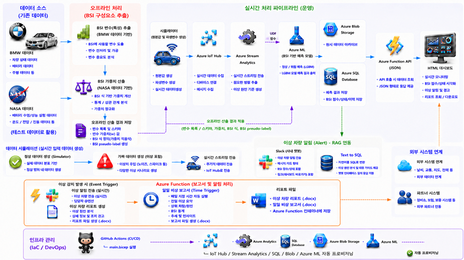
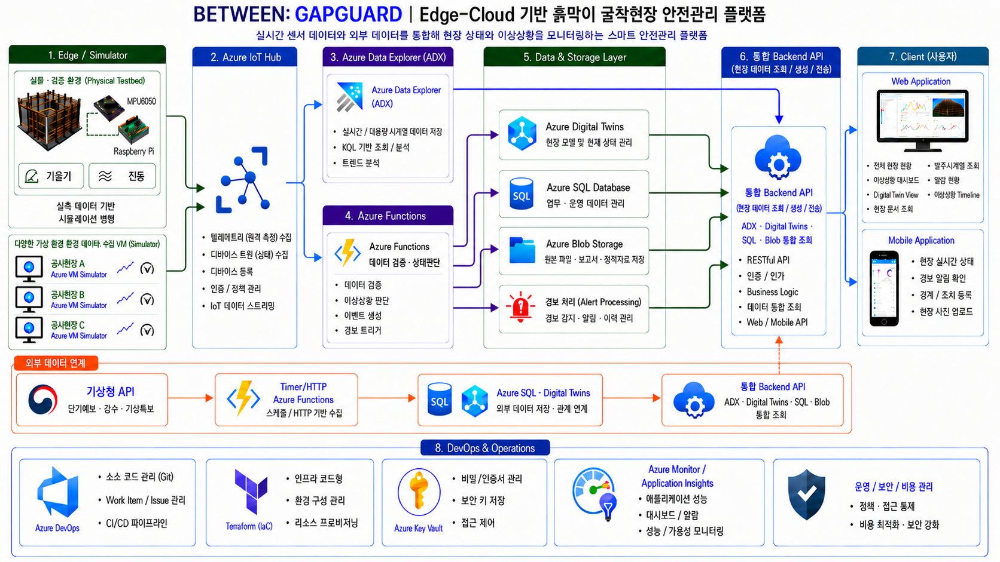

# 안다은 | Cloud · Data · DevOps Engineer

클라우드 기반 **데이터 파이프라인과 클라우드 아키텍처를 설계·구축하며**,
IaC와 CI/CD를 기반으로 **인프라 구성부터 배포·운영까지 반복 가능한 환경을 만듭니다.**

`Data Engineering` `Cloud Architecture` `DevOps` `Azure`

---

## 👩‍💻 Profile

* **Name** · 안다은
* **Field** · Cloud / Data Engineering / DevOps
* **Education** · 국립한밭대학교 컴퓨터공학과 졸업
* **Experience** · IT Intern · Lab Leader · Microsoft Data School 4기
* **Focus** · Azure · Data Pipeline · IaC · CI/CD

---

## 🛠 Tech Stack

**Cloud / Data**
`Azure` `IoT Hub` `Event Hubs` `Stream Analytics` `Functions` `Azure SQL` `Databricks` `ADX`

**DevOps / Infra**
`Git` `GitHub Actions` `Docker` `Bicep` `Terraform`

**Development**
`Python` `SQL` `Pandas` `FastAPI` `REST API`

---

# 🚀 Projects

## 01. EV Battery Monitoring

**Azure 기반 실시간 EV 배터리 이상 탐지 시스템**

`Azure IoT Hub` `Stream Analytics` `Azure SQL` `Functions` `Bicep`

  

**Role · Team Leader / Data Engineering**

* 센서 데이터 수집 → 처리 → 저장 → API 흐름 설계
* Stream Analytics 기반 실시간 처리
* Azure SQL Schema 및 조회 구조 설계
* Azure Functions API · Dashboard 연동
* Bicep 기반 Azure Infrastructure 구성

[Repository →](PROJECT_REPOSITORY_URL)

---

## 02. STOCK CRAFT

**Azure 기반 실시간 디지털 트윈 주식 거래 샌드박스**

`Event Hubs` `Stream Analytics` `Azure SQL` `Databricks` `Functions` `OpenAI`

  

**Role · Team Leader / Data Engineering / AI Reporting**

* 프로젝트 전체 데이터 흐름 설계
* Azure SQL Schema · Table · Column 설계
* 실시간 주문·체결 데이터 처리 구조 구성
* Azure SQL ↔ Databricks 분석 데이터 흐름 설계
* Azure Functions · OpenAI 기반 거래 행동 분석 보고서 연동

[Repository →](https://github.com/dandan-is-dandan/azure-realtime-stock-trading-platform)

---

## 03. GapGuard

**Edge–Cloud 기반 굴착 공사현장 이상징후 감지 및 다현장 안전관리 플랫폼**

`Azure` `Terraform` `Docker` `GitHub Actions` `IoT Hub`

  

**Role · DevOps / CI·CD / Cloud Infrastructure**

* Git Repository · Branch · PR 전략 구성
* Docker 기반 실행 환경 표준화
* GitHub Actions 기반 CI/CD Pipeline 구축
* Terraform 기반 Azure Infrastructure 관리
* 배포 환경 · Secret · Monitoring 구성

🚧 In Progress

[Repository →](PROJECT_REPOSITORY_URL)

---

# 💼 Experience

**Microsoft Data School 4기** · `2026.03 – 2026.09`
Azure 기반 **Data Engineering · Cloud Architecture · DevOps** 프로젝트

**두우엔지니어링 · IT Intern** · `2025.07 – 2025.09`
Python · Pandas 기반 **FRS 이미지 데이터 정형화 및 처리 프로그램 개발**

**컴퓨터공학과 임베디드 연구실 (DfX)** · `2025.01 – 2025.10`
Vision 기반 **좌표 변환 · Robot Arm 제어 시스템 개발**

**컴퓨터공학과 빅데이터 분석 연구실 · Lab Leader** · `2023.10 – 2025.01`
센서 · 산업 공정 데이터 **전처리 · 분석 · 시계열 모델링 연구**

**자작자동차동아리** · `2023.03 – 2024.10`
Baja / EV 차량 제작 및 **배터리 전압·전류·전력 데이터 분석**

---

# 🔬 Research & Other Work

**ETRI 제지공정 전력 최적화 연구**
`Time Series` `LSTM` `Industrial Data`

**Raspberry Pi 기반 음성 인터랙션 스마트 폐기물 관리 시스템**
`Raspberry Pi` `Embedded` `Voice Interaction`

---

# 📄 Publications

* **KICS 2024** · 멀티 센서 기반 스마트홈 공기질 모니터링
* **IEEK 2024** · 스팀량 예측 기반 공정 에너지 효율 모니터링
* **KICS 2024** · 딥러닝 전처리 및 클러스터링 기반 실시간 공기질 모니터링

---

# 🏆 Awards

* **KT 기업 연계 오픈 데이터 활용 스타트업 챌린지 · 우수상**
  이상주행차량 탐지 프로젝트

* **유성구 지역문제해결 경진대회 · 우수상**
  도로 포트홀 문제 해결 프로젝트

* **지역대학 연계 지역의제 발표대회 · 장려상**
  과학도시 대전의 과학 명소를 활용한 시민 참여형 도시 체험 서비스

* **SP!ED Global Capstone Design · Bronze**
  Raspberry Pi 기반 음성 인터랙션 스마트 폐기물 관리 시스템

---

# 📜 Certifications

* Microsoft Certified: **Azure Data Fundamentals (DP-900)**
* **SQLD**
* **ADsP**
* **빅데이터분석기사** · 필기 합격
* **정보처리기사** · 필기 합격

---

# 🌏 Other

* Canada Short-term (1 month) Language Program · 2022
---

# 📫 Contact

[Email](mailto:cyma54@naver.com) · [GitHub](https://github.com/dandan-is-dandan)
